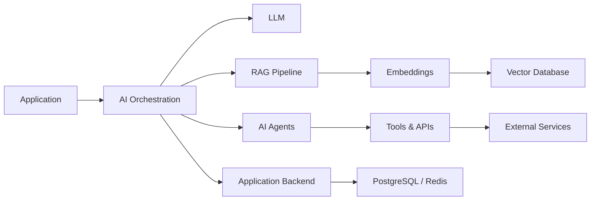

<!--
  GitHub Profile README
  Replace:
  YOUR_NAME
  YOUR_GITHUB_USERNAME
  YOUR_LOCATION
  YOUR_LINKEDIN_USERNAME
  YOUR_EMAIL
  YOUR_WEBSITE
  YOUR_REPOSITORY_ONE
  YOUR_REPOSITORY_TWO
-->

<div align="center">


</div>

<div align="center">

### Senior Software & AI Engineer

**Full-Stack Engineering • AI/LLM Systems • Cloud Architecture • Scalable Backend Systems**

Building production-ready software and intelligent systems from architecture to deployment.

</div>

<div align="center">

<a href="https://github.com/codeplane1016?tab=followers">
  
</a>


</div>

---

## 👨‍💻 About Me

I'm **YOUR NAME**, a **Senior Software & AI Engineer** based in **YOUR LOCATION**, specializing in building scalable web platforms, backend systems, cloud infrastructure, and AI-powered applications.

I work across the full software development lifecycle — from system architecture and database design to frontend development, APIs, AI integration, infrastructure, deployment, testing, and performance optimization.

My current focus is on combining **modern software engineering with Generative AI**, particularly LLM applications, RAG systems, AI agents, semantic search, automation, and intelligent developer tools.

* 🔭 Building **scalable SaaS platforms and AI-powered applications**
* 🧠 Working with **LLMs, RAG, AI agents, embeddings, vector databases, and tool calling**
* ⚙️ Designing **distributed backend services and production APIs**
* ☁️ Deploying applications using **AWS, Docker, Kubernetes, Vercel, and modern CI/CD**
* 🚀 Focused on **performance, scalability, maintainability, and clean architecture**
* 🤝 Open to **senior engineering, AI engineering, architecture, freelance, and technical leadership opportunities**

---

## 🧠 AI & LLM Engineering

```text
Generative AI       LLM Applications        Retrieval-Augmented Generation
AI Agents           Semantic Search         Embeddings
Vector Databases    Prompt Engineering      Tool / Function Calling
AI Automation       Knowledge Systems       LLM API Integration
```

I build AI functionality as part of real production systems rather than isolated demos — connecting models with application data, APIs, databases, search systems, authentication, and business workflows.

---

## 🛠️ Technology Stack

### Languages

<div align="center">


</div>

### Frontend

<div align="center">


</div>

### Backend & APIs

<div align="center">


</div>

### Databases & Data

<div align="center">


</div>

### Cloud & DevOps

<div align="center">


</div>

### Development Tools

<div align="center">


</div>

---

## 🏗️ Engineering Expertise

| Area                     | Experience                                                                   |
| ------------------------ | ---------------------------------------------------------------------------- |
| **Frontend Engineering** | React, Next.js, Vue, Nuxt, Angular, TypeScript, Tailwind CSS                 |
| **Backend Engineering**  | Node.js, NestJS, Express, Python, FastAPI, Django, Java/Spring Boot, Laravel |
| **AI Engineering**       | LLM integration, RAG, AI agents, embeddings, vector search, tool calling     |
| **Databases**            | PostgreSQL, MySQL, MongoDB, Redis, Prisma, Supabase                          |
| **Architecture**         | REST APIs, microservices, distributed systems, event-driven architecture     |
| **Cloud**                | AWS, GCP, Vercel, Railway                                                    |
| **DevOps**               | Docker, Kubernetes, GitHub Actions, CI/CD, Terraform, Linux                  |
| **Security**             | OAuth2, JWT, RBAC, API security, authentication and authorization            |
| **Performance**          | Caching, query optimization, API optimization, frontend performance          |

---

## 🤖 AI Engineering Focus



My AI architecture work commonly combines:

**Application → AI orchestration → LLM → retrieval → tools → business systems**

with production concerns including authentication, observability, caching, latency, cost control, evaluation, and failure handling.

---

## 📊 GitHub Analytics

<div align="center">


</div>

<div align="center">


</div>

---

## 📈 Contribution Activity

<div align="center">


</div>

---

## 🚀 Featured Projects

<div align="center">

Add your best repositories here after you have public projects to feature.

</div>

---

## 💡 What I Build

I enjoy solving technically challenging problems and turning complex requirements into maintainable production systems.

Typical projects include:

* AI-powered SaaS applications
* RAG and enterprise knowledge systems
* AI agents and workflow automation
* High-performance web applications
* REST API and microservice architectures
* Real-time platforms
* E-commerce systems
* Authentication and authorization platforms
* Cloud-native backend infrastructure
* Data processing and integration systems
* Developer tools and internal automation
* Legacy system modernization

---

## 🎯 Engineering Principles

```text
Clean Architecture
        ↓
Simple Interfaces
        ↓
Reliable Systems
        ↓
Automated Testing
        ↓
Observable Infrastructure
        ↓
Continuous Improvement
```

I value software that is:

**Scalable • Testable • Secure • Observable • Maintainable • Performance-focused**

Good engineering is not just about making software work — it is about making systems understandable, reliable, and easy to evolve.

---

## 📫 Connect With Me

<div align="center">

<a href="https://www.linkedin.com/in/YOUR_LINKEDIN_USERNAME/">
  
</a>

<a href="mailto:bilokopitovartem505@gmail.com">
  
</a>

<a href="https://YOUR_WEBSITE">
  
</a>

</div>

<br />

<div align="center">

### Let's build software that solves real problems.

<i>Software Engineering • Artificial Intelligence • Cloud Architecture</i>

</div>


