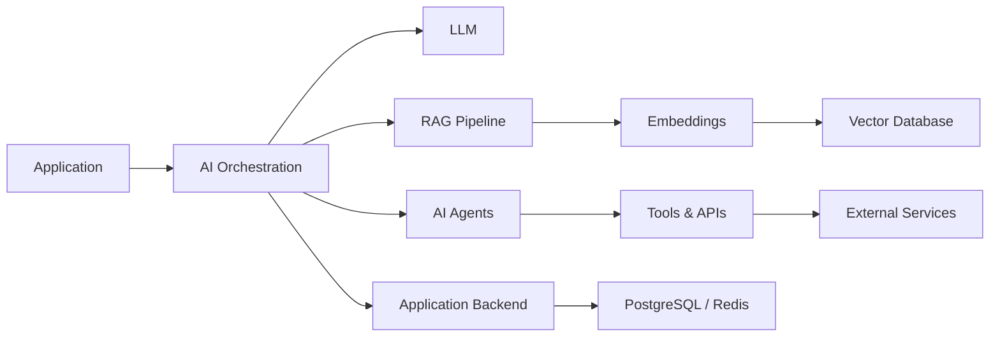
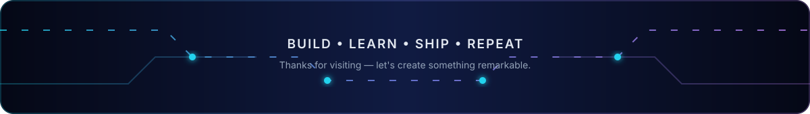

<!--
  GitHub Profile README
  Replace:
  YOUR_NAME
  YOUR_GITHUB_USERNAME
  YOUR_LOCATION
  YOUR_LINKEDIN_USERNAME
  YOUR_EMAIL
  YOUR_WEBSITE
  YOUR_REPOSITORY_ONE
  YOUR_REPOSITORY_TWO
-->

<div align="center">


</div>

<div align="center">

**Full-Stack Engineering • AI/LLM Systems • Cloud Architecture • Scalable Backend Systems**

Building production-ready software and intelligent systems from architecture to deployment.

</div>

---

## 👨‍💻 About Me

I'm a **Senior Software & AI Engineer** specializing in scalable web platforms, backend systems, cloud infrastructure, and AI-powered applications.

I work across the full software development lifecycle — from system architecture and database design to frontend development, APIs, AI integration, infrastructure, deployment, testing, and performance optimization.

My current focus is on combining **modern software engineering with Generative AI**, particularly LLM applications, RAG systems, AI agents, semantic search, automation, and intelligent developer tools.

* 🔭 Building **scalable SaaS platforms and AI-powered applications**
* 🧠 Working with **LLMs, RAG, AI agents, embeddings, vector databases, and tool calling**
* ⚙️ Designing **distributed backend services and production APIs**
* ☁️ Deploying applications using **AWS, Docker, Kubernetes, Vercel, and modern CI/CD**
* 🚀 Focused on **performance, scalability, maintainability, and clean architecture**
* 🤝 Open to **senior engineering, AI engineering, architecture, freelance, and technical leadership opportunities**

---

## 🧠 AI & LLM Engineering

```text
Generative AI       LLM Applications        Retrieval-Augmented Generation
AI Agents           Semantic Search         Embeddings
Vector Databases    Prompt Engineering      Tool / Function Calling
AI Automation       Knowledge Systems       LLM API Integration
```

I build AI functionality as part of real production systems rather than isolated demos — connecting models with application data, APIs, databases, search systems, authentication, and business workflows.

---

## 🛠️ Technology Stack

<table align="center">
  <tr>
    <th colspan="8">Languages</th>
  </tr>
  <tr>
    <td align="center"><br />TypeScript</td>
    <td align="center"><br />JavaScript</td>
    <td align="center"><br />Python</td>
    <td align="center"><br />Java</td>
    <td align="center"><br />Go</td>
    <td align="center"><br />Rust</td>
    <td align="center"><br />PHP</td>
    <td align="center"><br />C#</td>
  </tr>
  <tr>
    <th colspan="8">Frontend</th>
  </tr>
  <tr>
    <td align="center"><br />React</td>
    <td align="center"><br />Next.js</td>
    <td align="center"><br />Vue</td>
    <td align="center"><br />Nuxt</td>
    <td align="center"><br />Angular</td>
    <td align="center"><br />Tailwind</td>
    <td align="center"><br />HTML</td>
    <td align="center"><br />CSS</td>
  </tr>
  <tr>
    <th colspan="8">Backend and APIs</th>
  </tr>
  <tr>
    <td align="center"><br />Node.js</td>
    <td align="center"><br />NestJS</td>
    <td align="center"><br />Express</td>
    <td align="center"><br />Django</td>
    <td align="center"><br />FastAPI</td>
    <td align="center"><br />Laravel</td>
    <td align="center"><br />Spring</td>
    <td align="center"><br />.NET</td>
  </tr>
  <tr>
    <th colspan="8">Databases and Data</th>
  </tr>
  <tr>
    <td align="center"><br />PostgreSQL</td>
    <td align="center"><br />MySQL</td>
    <td align="center"><br />MongoDB</td>
    <td align="center"><br />Redis</td>
    <td align="center"><br />Supabase</td>
    <td align="center"><br />Prisma</td>
    <td align="center">🔎<br />Vector DB</td>
    <td align="center">📊<br />Data</td>
  </tr>
  <tr>
    <th colspan="8">Cloud and DevOps</th>
  </tr>
  <tr>
    <td align="center"><br />AWS</td>
    <td align="center"><br />GCP</td>
    <td align="center"><br />Docker</td>
    <td align="center"><br />Kubernetes</td>
    <td align="center"><br />Terraform</td>
    <td align="center"><br />Actions</td>
    <td align="center"><br />Vercel</td>
    <td align="center"><br />Linux</td>
  </tr>
  <tr>
    <th colspan="8">Development Tools</th>
  </tr>
  <tr>
    <td align="center"><br />Git</td>
    <td align="center"><br />GitHub</td>
    <td align="center"><br />VS Code</td>
    <td align="center"><br />Postman</td>
    <td align="center"><br />Nginx</td>
    <td align="center"><br />Bash</td>
    <td align="center"><br />Figma</td>
    <td align="center"><br />Copilot</td>
  </tr>
</table>

---

## 🏗️ Engineering Expertise

### 🎨 Frontend Engineering

React · Next.js · Vue · Nuxt · Angular · TypeScript · Tailwind CSS

### ⚙️ Backend Engineering

Node.js · NestJS · Express · Python · FastAPI · Django · Java · Spring Boot · Laravel

### 🧠 AI Engineering

LLM integration · RAG · AI agents · Embeddings · Vector search · Tool calling

### 🏗️ Systems and Architecture

REST APIs · Microservices · Distributed systems · Event-driven architecture · PostgreSQL · MySQL · MongoDB · Redis

### ☁️ Cloud and DevOps

AWS · GCP · Vercel · Railway · Docker · Kubernetes · GitHub Actions · CI/CD · Terraform · Linux

### 🔐 Security and Performance

OAuth2 · JWT · RBAC · API security · Caching · Query optimization · API optimization · Frontend performance

---

## 🤖 AI Engineering Focus



My AI architecture work commonly combines:

**Application → AI orchestration → LLM → retrieval → tools → business systems**

with production concerns including authentication, observability, caching, latency, cost control, evaluation, and failure handling.

---

## 🚀 Featured Projects

<div align="center">

Add your best repositories here after you have public projects to feature.

</div>

---

## 💡 What I Build

I enjoy solving technically challenging problems and turning complex requirements into maintainable production systems.

Typical projects include:

* AI-powered SaaS applications
* RAG and enterprise knowledge systems
* AI agents and workflow automation
* High-performance web applications
* REST API and microservice architectures
* Real-time platforms
* E-commerce systems
* Authentication and authorization platforms
* Cloud-native backend infrastructure
* Data processing and integration systems
* Developer tools and internal automation
* Legacy system modernization

---

## 🎯 Engineering Principles

```text
Clean Architecture
        ↓
Simple Interfaces
        ↓
Reliable Systems
        ↓
Automated Testing
        ↓
Observable Infrastructure
        ↓
Continuous Improvement
```

I value software that is:

**Scalable • Testable • Secure • Observable • Maintainable • Performance-focused**

Good engineering is not just about making software work — it is about making systems understandable, reliable, and easy to evolve.

---

## 📫 Connect With Me

<div align="center">

<a href="https://www.linkedin.com/in/YOUR_LINKEDIN_USERNAME/">
  
</a>

<a href="mailto:bilokopitovartem505@gmail.com">
  
</a>

<a href="https://YOUR_WEBSITE">
  
</a>

</div>

<br />

<div align="center">

### Let's build software that solves real problems.

<i>Software Engineering • Artificial Intelligence • Cloud Architecture</i>

</div>

---

## 🐍 Contribution Snake

<div align="center">

<picture>
  <source media="(prefers-color-scheme: dark)" srcset="https://raw.githubusercontent.com/codeplane1016/codeplane1016/gh-pages/github-contribution-grid-snake-dark.svg" />
  <source media="(prefers-color-scheme: light)" srcset="https://raw.githubusercontent.com/codeplane1016/codeplane1016/gh-pages/github-contribution-grid-snake.svg" />
  
</picture>

</div>


